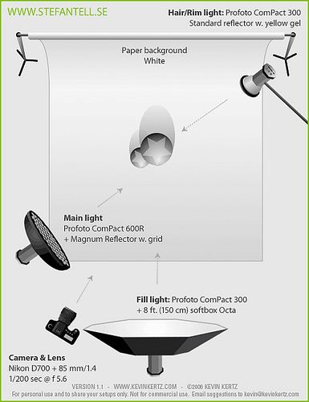
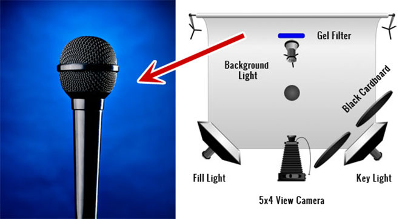
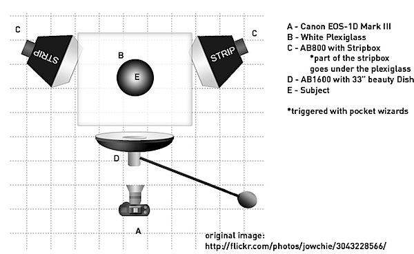
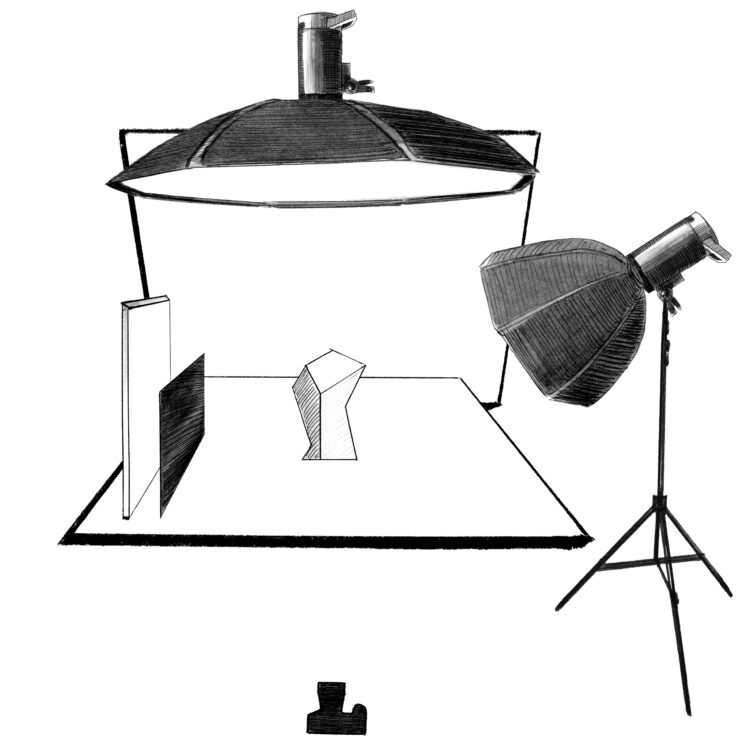

# Библиотека Three.js

**Цель**: изучить основы библиотеки Three.js и получить навыки отображения трехмерной модели в браузере с помощью библиотеки.

## Содержание и порядок выполнения лабораторной работы:

1. Подключить к странице конкретной модели библиотеку three.js.
1. Создать renderer, scene, camera c требуемыми параметрами.
1. Добавьте горизонтальную плоскость, на которой в дальнейшем будет размещаться модель.
1. Добавьте в сцену на фон вертикальную плоскость с помощью bufferGeometry.
1. Добавьте на сцену один объект из готовой геометрии (куб, сфера и т.д.) и треугольную пирамиду с помощью bufferGeometry.
1. Добавьте к сцене разные типы источников света по одной из схем ниже.
1. Модели должны отбрасывать тени от источников света на плоскости.
1. Добавить элементы формы для возможности изменения цвета моделей и влючения и выключения источников освещения.

## Схемы

## Результаты выполнения лабораторной работы:

Завершенная страница конкретной модели с элементом canvas и отображением в нем трехмерной модели. Завершенный проект для работы с моделями.

## Источники

1. [Пример с занятия](https://github.com/slavaver/threejs-example)
1. [Мануал Three.js](https://threejs.org/manual/#ru/fundamentals)
1. [Введение в 3D: основы Three.js](https://habr.com/ru/post/494810/)
1. [Документация Three.js](https://threejs.org/docs/index.html#manual/en/introduction/Creating-a-scene)
1. [Пример разборки с react](https://codesandbox.io/embed/motor-part-explosion-hli8gy)
1. [Пример использования WebGL](https://ciechanow.ski/archives/)
1. [Discover Three.js](https://discoverthreejs.com/)